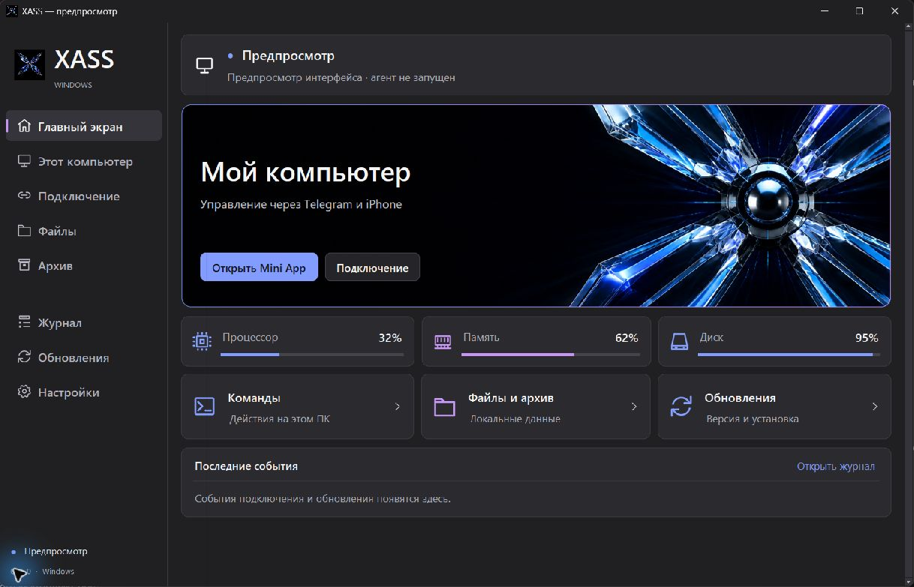
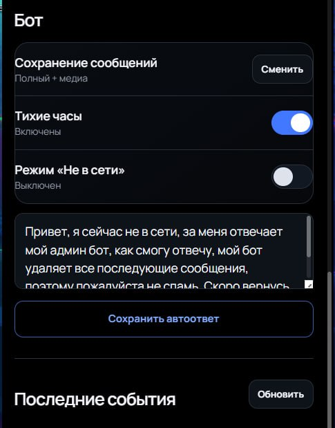
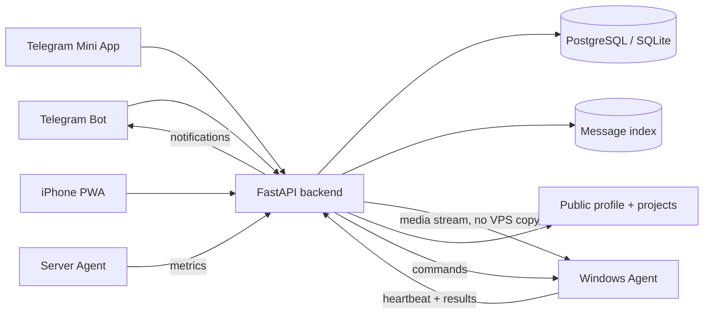

<p align="center">
  
</p>

<h1 align="center">XASS</h1>

<p align="center">
  <strong>Личный центр управления для Telegram, Windows, сервера, сайта и iPhone.</strong><br>
  Один backend, несколько интерфейсов и никакой россыпи отдельных панелей.
</p>

<p align="center">
  <a href="https://redvps.site">Сайт</a> ·
  <a href="https://redvps.site/miniapp.php">Mini App</a> ·
  <a href="https://github.com/lucifervalter-a11y/XASS/releases/download/agent-latest/XASS-Setup.exe">Скачать для Windows</a> ·
  <a href="./docs/OPERATIONS.md">Документация</a>
</p>

<p align="center">
  
  
  
  
  
</p>

## Что такое XASS

XASS объединяет персонального Telegram Business‑бота, мониторинг компьютеров и сервера, удалённые команды, управление публичным профилем, музыку, погоду и устанавливаемое iPhone‑веб‑приложение.

Проект задуман как единая личная система: компьютер сообщает состояние через heartbeat, backend хранит и обрабатывает данные, Mini App управляет системой, а публичный сайт показывает только то, что разрешено владельцем.

## Интерфейсы

<table>
  <tr>
    <td colspan="2" align="center">
      
      <br><sub><b>XASS Desktop Agent</b> — состояние подключения, локальные метрики, события и обновления.</sub>
    </td>
  </tr>
  <tr>
    <td width="50%" align="center">
      
      <br><sub><b>Публичный профиль</b> — проекты, цитаты, контакты и живая активность.</sub>
    </td>
    <td width="50%" align="center">
      
      <br><sub><b>Telegram Mini App</b> — мобильная панель владельца.</sub>
    </td>
  </tr>
</table>

## Возможности

| Поверхность | Что умеет |
|---|---|
| Telegram | Business‑бот, полные переписки, история правок и удалений, уведомления и команды владельца |
| Mini App | Единый центр состояния, агенты, Screenshot, безопасные файлы, Clipboard, Timeline, Rules, уведомления, аудит, переписки и управление сайтом |
| Windows | Нативное приложение, автозапуск, CPU/RAM/Disk, снимок экрана по запросу, ограниченный файловый доступ, Clipboard, локальный архив и автообновления |
| iPhone / PWA | Вход и подтверждение опасных действий через Face ID / Passkey, установка на экран «Домой» |
| Публичный сайт | Профиль, проекты, цитаты, аватары, контакты, погода и музыка с раздельными зонами интерфейса |
| Backend | FastAPI, heartbeat, PostgreSQL/SQLite, очередь команд, экспорт, резервные копии и контроль состояния сервисов |

### Управление компьютерами

- Подключение ПК одноразовым кодом или файлом `xass-connect.xass`.
- Отдельный API‑ключ для каждого устройства.
- Удалённые команды: проверить связь и обновление, открыть/очистить архив, обновить или перезапустить агент, заблокировать, усыпить, перезагрузить и выключить Windows.
- История команд показывает очередь и результат; отложенную команду можно отменить до выполнения.
- Снимок экрана создаётся только по команде, временно хранится на backend и заменяет предыдущий кадр этого агента.
- Файловый менеджер ограничен папками `Рабочий стол`, `Загрузки`, `Документы` и `XASS Files`; каталог и файлы передаются только по запросу, а `../` и абсолютные пути блокируются на backend и агенте.
- Clipboard читается и меняется только явными командами; Mini App хранит короткую локальную историю, которую можно очистить.
- Timeline объединяет состояние агентов, команды, уведомления и аудит. Простые правила `ЕСЛИ → ТО` выполняются серверным scheduler.
- Одинаковое подтверждение команд в Telegram и standalone PWA; при настроенном Passkey блокировка и перезапуск требуют биометрию устройства.
- Подписанные манифесты обновлений и проверка SHA‑256 перед установкой.
- Локальный статус соединения, не зависящий от буферизации журнала процесса.

### Переписки и локальный архив

- Mini App показывает диалоги, удалённые сообщения, правки и доступные превью медиа; в боте есть `/chats`, `/chat`, `/deleted` и `/archive`.
- При `SAVE_FULL` сервер хранит индекс и Telegram `file_id`, но не сохраняет байты медиа на диск VPS.
- В Mini App можно выбрать один или несколько ПК‑агентов для архива. Каждый выбранный агент сохраняет SQLite‑индекс и файлы в выбранную в Windows‑приложении папку.
- Локальное хранилище проверяет размер и SHA‑256, устраняет дубликаты по `file_unique_id`, повторяет неудачную доставку и поддерживает лимит размера, срок хранения и ручную очистку медиа без удаления текстов.
- Telegram сообщает об удалении только для Business‑переписок, доступных подключённому бизнес‑боту. Обычный Bot API не присылает произвольные удаления из чужих чатов.

### Музыка и активность

- Источники now playing: Windows‑агент, iPhone Shortcuts или VK.
- Поиск трека и карточки со ссылками на музыкальные сервисы.
- Фильтрация браузерных вкладок и приложений, которые не являются музыкой.
- Передача текущей активности в профиль и автоответы только при включённой функции.

### Сайт и контент

- Редактор профиля, проектов, ссылок, стека и цитат из Mini App и Telegram; порядок проектов и цитат меняется без ручного редактирования JSON.
- Галерея аватаров с загрузкой изображений владельцем.
- Обложки проектов загружаются из галереи или задаются URL.
- Автопогода через Open‑Meteo и отдельный блок контактов без смешивания данных.
- Бэкап и аудит каждого изменения контента.

## Как всё связано



## Быстрый старт

### Windows‑клиент

Скачайте актуальный установщик: **[XASS‑Setup.exe](https://github.com/lucifervalter-a11y/XASS/releases/download/agent-latest/XASS-Setup.exe)**.

После установки откройте в Mini App раздел `Агенты → Подключить ПК`, скачайте файл подключения и импортируйте его в XASS. Адрес сервера и одноразовый ключ уже находятся внутри файла.

### Сервер одной командой

```bash
bash <(curl -fsSL https://raw.githubusercontent.com/lucifervalter-a11y/XASS/main/bootstrap-install.sh)
```

Мастер создаст конфигурацию, установит зависимости и предложит включить systemd‑сервисы. Для публичного Mini App и iPhone PWA нужен HTTPS‑домен.

### Локальная разработка

```bash
git clone https://github.com/lucifervalter-a11y/XASS.git
cd XASS
python -m venv .venv
source .venv/bin/activate
pip install -r requirements.txt
cp .env.example .env
uvicorn app.main:app --reload --port 8000
```

На Windows достаточно запустить `run_server.bat`: он проверит Python, создаст окружение и установит зависимости автоматически.

## Минимальная конфигурация

| Переменная | Назначение |
|---|---|
| `BOT_TOKEN` | Токен Telegram‑бота из BotFather |
| `OWNER_USER_ID` | Telegram ID владельца |
| `DATABASE_URL` | PostgreSQL для production или SQLite для локального запуска |
| `AGENT_API_KEY` | Резервный общий ключ heartbeat; новые ПК получают персональные ключи |
| `PROFILE_PUBLIC_URL` | Публичный HTTPS‑адрес сайта и Mini App |
| `USE_POLLING` | `true` для локального запуска без webhook |
| `PWA_COOKIE_SECURE` | `true` на публичном HTTPS‑домене |
| `PWA_VAPID_PUBLIC_KEY`, `PWA_VAPID_PRIVATE_KEY`, `PWA_VAPID_SUBJECT` | Необязательные VAPID‑ключи для Web Push установленного PWA |

Полный шаблон находится в [`.env.example`](./.env.example), а подробная установка — в [`docs/OPERATIONS.md`](./docs/OPERATIONS.md).

## Сценарии подключения

<details>
<summary><b>Подключить новый Windows‑компьютер</b></summary>

1. Откройте XASS Mini App.
2. Перейдите в `Агенты → Подключить ПК`.
3. Скачайте `xass-connect.xass` или скопируйте одноразовый код.
4. Импортируйте файл в Windows‑приложение.
5. После первого heartbeat компьютер появится в списке агентов.

</details>

## Центры управления и резервные копии

- Экран состояния получает backend, базу, Telegram, публичный сайт и агентов одним агрегированным запросом; агенты фильтруются по доступности, вниманию и версии.
- Сценарии запускают выбранные действия последовательно, поддерживают задержку и ежедневное расписание, сохраняют результат каждого шага и блокируют повторный параллельный запуск.
- Внутренний центр уведомлений имеет приоритеты, тихие часы и отдельные правила каналов. Web Push помечается доступным только в совместимом браузере; внутренние и Telegram‑уведомления продолжают работать независимо от него.
- Для Web Push сгенерируйте отдельную VAPID‑пару, сохраните приватный ключ только в `.env`, перезапустите backend, затем включите Push внутри установленного PWA. Без этих переменных переключатель Push намеренно недоступен.
- Audit log сокращает IP и удаляет токены, пароли, ключи и содержимое конфигураций до записи.
- Экспорт `.xass-backup` шифруется AES‑256‑GCM с ключом из Scrypt. Перед импортом показывается состав, а действующие секреты никогда не экспортируются и не заменяются.
- Диагностика проверяет базу, сайт, Telegram, архив, обновления, диск и конфигурацию; отчёт не содержит секретов.

<details>
<summary><b>Добавить XASS на экран «Домой» iPhone</b></summary>

1. В Mini App откройте `Инструменты → iPhone и веб‑приложение`.
2. Укажите публичный HTTPS‑адрес XASS.
3. Создайте одноразовую ссылку и откройте её в Safari.
4. Нажмите `Поделиться → На экран Домой`.

Одноразовый токен хранится в базе только как SHA‑256‑хэш, действует ограниченное время и аннулируется после первого использования.

</details>

<details>
<summary><b>Подключить музыку с iPhone или VK</b></summary>

- iPhone: создайте ключ через `/connect_iphone` и импортируйте подготовленный Shortcut.
- VK: используйте `/connect_vk`, затем сохраните `VK_USER_ID` и access token.
- Источник переключается командой `/nowsource <pc|iphone|vk>` или кнопками Mini App.

</details>

## Безопасность

- Telegram Mini App проверяет подписанный `initData` и права владельца.
- PWA использует подписанную `HttpOnly`‑сессию и одноразовый код во фрагменте URL, который не попадает в HTTP‑логи.
- Passkey/Face ID/Touch ID/Windows Hello используется для входа и повторного подтверждения опасных действий; владелец может переименовать или удалить доверенное устройство и завершить все standalone‑сеансы.
- Pair‑коды для агентов короткоживущие; после обмена устройство получает собственный ключ.
- Пакеты агента подписываются HMAC и проверяются по SHA‑256.
- Секреты и рабочие конфиги исключены из пакетов обновлений и Git‑репозитория.
- Серверные перезапуски и обновления выполняются после отправки HTTP‑ответа, чтобы UI не зависал.

## Структура проекта

```text
app/                    FastAPI backend и Telegram‑логика
app/services/           heartbeat, агенты, контент, музыка, погода, обновления
pc_client/              Windows‑приложение, агент, установщик и updater
agent/                  кроссплатформенный server/PC agent
miniapp.php             Telegram Mini App и iPhone PWA
profile.php             публичный профиль
projects.php            страница проектов
deploy/                 systemd, установка, обновление и бэкапы
tests/                  unit и integration‑проверки
docs/                   изображения и operational reference
```

## Разработка и проверки

```bash
python -m unittest discover -s tests -v
python -m compileall -q app pc_client tests
```

Тесты покрывают привязку агентов, подписанные обновления, PWA‑авторизацию, одноразовые ссылки, музыку, миграцию старого клиента, сайт и быстрый перезапуск сервиса.

GitHub Actions автоматически:

- разворачивает `main` на production‑сервер;
- собирает Windows‑установщик;
- публикует стабильный `XASS‑Setup.exe` в GitHub Releases;
- доставляет installer и metadata на сервер обновлений.

## Документация

- [Полная установка, команды и troubleshooting](./docs/OPERATIONS.md)
- [Windows Agent](./pc_client/README.md)
- [Шаблон конфигурации](./.env.example)
- [Последняя стабильная версия Windows](https://github.com/lucifervalter-a11y/XASS/releases/tag/agent-latest)

---

<p align="center">
  <sub>XASS — когда личная инфраструктура ощущается как один продукт.</sub>
</p>
