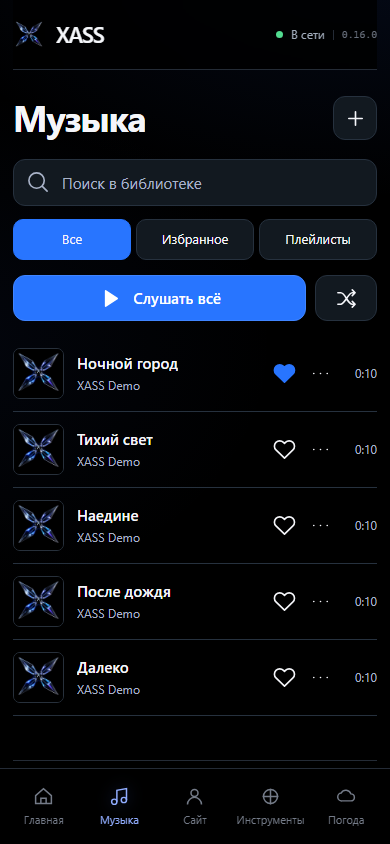
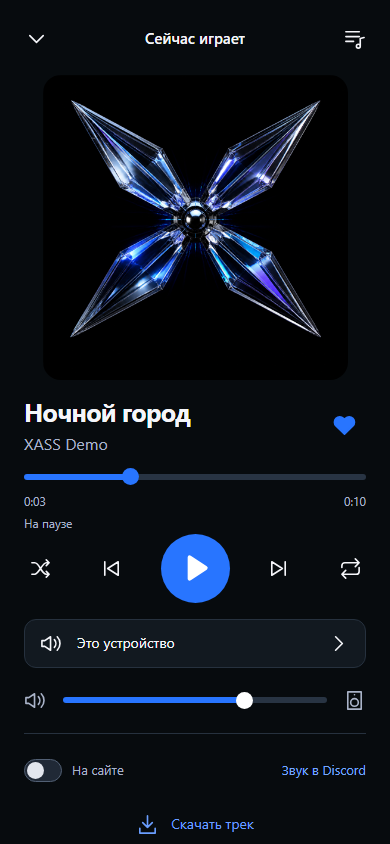

# Музыка в XASS

Личная библиотека, полноэкранный плеер и выбор устройства воспроизведения в одном интерфейсе Telegram Mini App и iPhone.

  
  

Скриншоты настоящего интерфейса, снятые при локальной QA-проверке. Названия демонстрационные; вместо музыки использован специально созданный WAV с тишиной. Это не выгрузка личной библиотеки.

## Как пользоваться

1. Откройте «Музыка» и нажмите **+**. Файлы отправляются частями; при обрыве связи кнопка повтора продолжит незавершённую загрузку.
2. Найдите трек, добавьте его в избранное или соберите плейлист. Меню трека позволяет изменить название и исполнителя, скачать файл и убрать его из библиотеки.
3. Нажмите название трека. Компактный плеер раскрывается нажатием на обложку или название; доступны очередь, перемотка, повтор и перемешивание.
4. В плеере выберите **Это устройство** или подключённый Windows-ПК, затем его аудиовыход. Для новых музыкальных команд необходим актуальный агент. Громкость и выбор выхода относятся к XASS, а не ко всей Windows.

MP3 и WAV — наиболее совместимый вариант. Windows-агент также воспроизводит FLAC и OGG Vorbis. M4A и OGG Opus не поддерживаются Windows-плеером; браузерная поддержка зависит от устройства. При ошибке формата интерфейс сообщает об этом, а не оставляет бесконечную загрузку.

## iPhone, фон и скачивание

В браузере используется HTML5 Audio и Media Session. Фоновая работа и системные кнопки зависят от браузера и iOS; веб-приложение не выдаёт себя за нативный плеер.

В iOS 0.17 библиотека, плеер и устройства — настоящие SwiftUI-экраны. Очередь и AirPlay/Bluetooth работают через AVPlayer. Скачанные вручную треки сохраняются в приложении. Часто слушаемые треки автоматически кэшируются после второго фактического запуска: лимит по умолчанию 256 МиБ, в настройках доступны отключение, 256, 512 и 1024 МиБ. Автоматическая очистка убирает наиболее давно использованные копии и никогда не удаляет ручные загрузки или серверные оригиналы. Кэширование работает во время работы приложения/аудиосессии, без отдельного системного сервиса загрузки. Кнопка скачивания в обычном браузере сохраняет файл в загрузки — это не скрытый офлайн-кэш авторизованной библиотеки.

Музыку можно также отправить в личный чат бота владельцем: одним файлом, пачкой сообщений, альбомом или ZIP. Порядок сообщений и файлов архива сохраняется; идентичные файлы повторно не добавляются. Через Telegram Bot API файл скачивается до 20 МиБ; более крупные файлы/ZIP загружайте из приложения. ZIP ограничен 200 треками, 500 элементами и 512 МиБ распакованных данных; опасные пути и вложенные архивы отклоняются.

В «Где слушать» переключение ждёт реального подтверждения остановки прежнего плеера и передаёт позицию. Одновременное multiroom-звучание не реализовано. Удалённые команды iPhone ожидают ответа до 30 секунд; спящий iPhone нужно открыть. Нет автоматического пробуждения без push-инфраструктуры.

Очередь на ПК продолжает работать после закрытия приложения на телефоне: следующий трек запускает сервер по подтверждённому состоянию агента. Это не gapless-воспроизведение; между треками возможна пауза до следующего heartbeat.

Раздел хранилища позволяет копировать треки на выбранный агент и возвращать их. Удаление серверной копии — отдельное подтверждаемое действие после проверки целостности копии. Импорт папки использует только явно выбранный разрешённый каталог ПК; исходники не меняются. VK сейчас проверяет подключение и права, но полный экспорт аудиотеки **не реализован без разрешённого доступа к музыкальной библиотеке**.

[Скачать IPA из GitHub Releases](https://github.com/lucifervalter-a11y/XASS/releases/tag/ios-latest). Сборка неподписанная: перед установкой нужна собственная подпись. [Подробности установки](../ios/UNSIGNED.md).

## Сайт и Discord

**На сайте** публикует выбранный трек в публичном профиле. Последнее устройство, на котором явно запущено воспроизведение, получает управление сессией.

**Звук в Discord** открывает инструкцию по маршрутизации: выбрать существующий виртуальный аудиовыход Windows в XASS, соответствующий виртуальный вход в Discord и подключиться к голосовому каналу. XASS не устанавливает аудиодрайверы и не входит в Discord автоматически.

## Приватность и ограничения

- Библиотека доступна владельцу; потоковые ссылки временные и привязаны к назначению.
- ПК принимает музыку только с адреса привязанного сервера. Произвольные внешние URL и перенаправления не разрешены.
- Удаление трека из библиотеки мягкое: ссылки отзываются, а серверный файл сохраняется для восстановления.
- Библиотека выдаётся страницами до 2000 треков; приложения догружают следующие страницы. Очередь нативного фонового плеера содержит до 200 треков вокруг выбранного.
- Тесты плеера используют собственную тишину и изолированные устройства. Системный аудиовыход пользователя автоматически не запускается во время QA.
